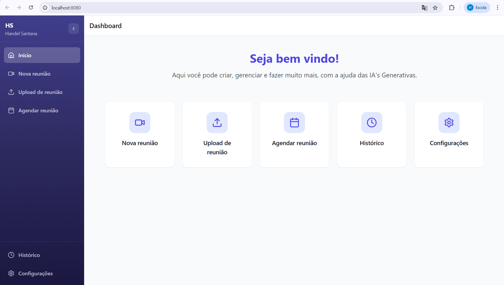
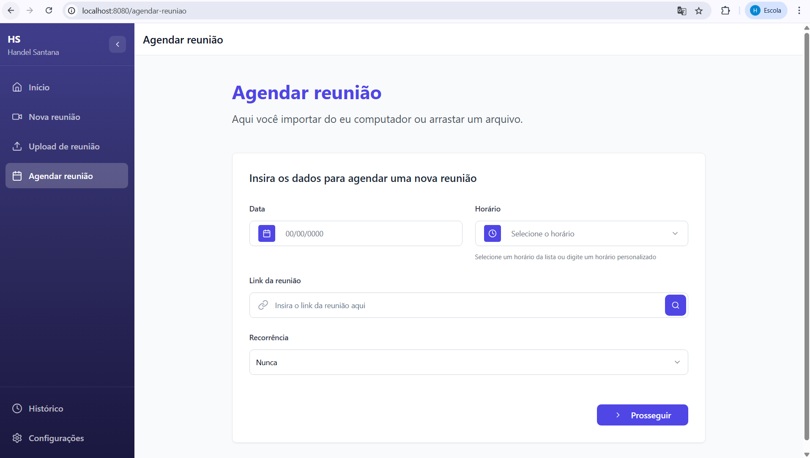
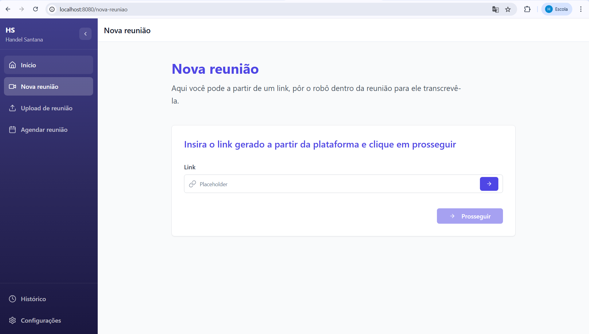
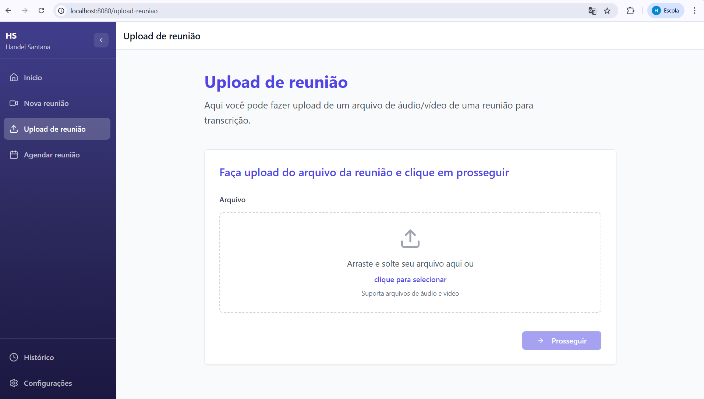
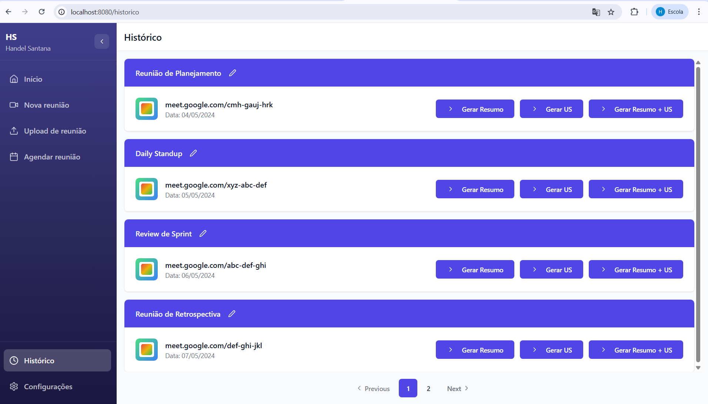

# 🧠 Sistema de Geração de Artefatos Ágeis com IA Generativa

Este projeto utiliza **IA Generativa** para automatizar a criação de artefatos ágeis como:

- ✅ Resumo de reuniões
- ✅ Geração de user stories (US)
- ✅ Criação de tasks a partir de discussões

---

## 🚀 Tecnologias Utilizadas

- **Next.js** — Interface web moderna e performática
- **FastAPI** — Backend ágil e escalável em Python
- **MongoDB** — Banco de dados NoSQL para armazenar os artefatos gerados

---

## 📸 Funcionalidades
# Demonstração do Software

Aqui estão algumas imagens da interface do sistema:

### 📌 Tela Inicial


### 📅 Agendar Reunião


### 🆕 Nova Reunião


### 📤 Upload de Arquivo na Reunião


### 📜 Histórico de Reuniões



---

## 🛠️ Instalação e Uso

> ⚠️ Este projeto **não está hospedado publicamente** e só está disponível mediante **solicitação para implantação interna** na empresa.

### Pré-requisitos:

- Node.js
- Python 3.9+
- MongoDB

### Passos iniciais (para desenvolvedores autorizados):

1. Clone o repositório:
   ```bash
   git clone https://github.com/handelsg/project-tcc-frontend
